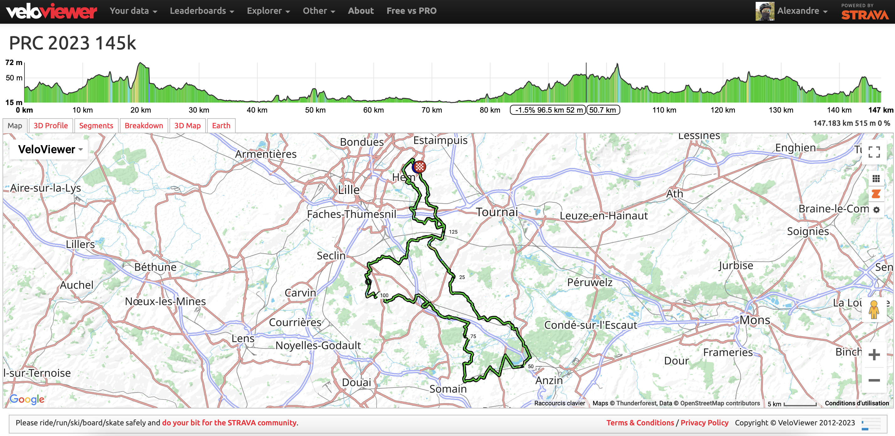

# Paris Roubaix Challenge 2023 145k 🚴🪨

Ce dépôt rassemble les informations que j'ai pu trouvées et enrichir sur le parcours du [Paris Roubaix Challenge 2023](https://www.parisroubaixchallenge.com) pour la version 145km.

_Disclaimer: ce ne sont pas des données officielles, utilisez les à vos risques et périls. J'imagine que l'organisation sortira un "vrai" tableau de marche d'ici le départ mais pas trouvé à date (2023-03-20)._

Sources :

- [Tableau de marche officiel 2022 — ASO](5-prc22-itin-raire-horaire-145km) — [lien original](https://storage-aso.lequipe.fr/ASO/egp/parisroubaixchallenge/5-prc22-itin-raire-horaire-145km.pdf)
- [Trace officielle 2023 — organisation](prc23_145km-14232365-1678266380-681.gpx.kml) - [page originale](https://www.parisroubaixchallenge.com/fr/la-course/parcours)

Conversion et ajouts :

- [Trace au format GPX](PRC-2023-145.gpx)
- [Tableau de marche repris de 2022, corrigé manuellement](tableau-marche-2023/)
- [Parcours sur Strava](https://www.strava.com/routes/3072476353458568258)
- [Parcours sur Veloviewer](https://veloviewer.com/routes/3072476353458568258/embed2)

Le tableau de marche corrigé comprend aussi des informations sur les secteurs pavés (longueur, difficulté, remarques), notamment [grâce à cette article de l'Equipe](https://www.lequipe.fr/Cyclisme-sur-route/Actualites/Paris-roubaix-la-carte-complete-des-secteurs-paves-et-les-horaires-de-passage-du-parcours-2018/889987).

Bonne course !

